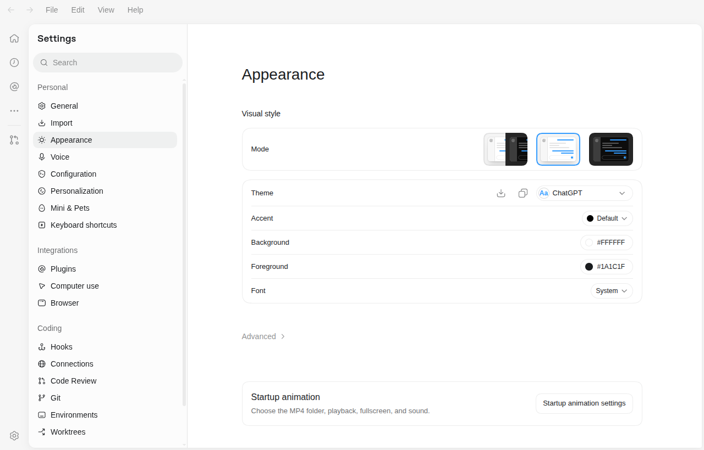
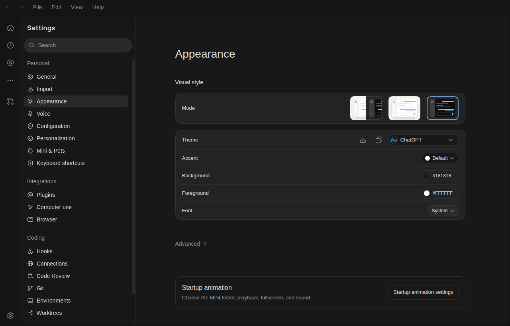

# 在原生 Appearance 中打开开屏动画设置

这是可选的、针对指定 Linux 应用版本的第三方集成。启用后，在 **Settings → Appearance** 页面末尾出现 **Startup animation settings / 开屏动画设置** 按钮，点击打开本项目的 GTK 设置窗口。

完整视频设置仍在独立窗口中：启用开关、MP4 文件夹、全屏、静音、异常超时、预览和恢复原启动入口。

实际隔离验收截图（英文界面；按钮随应用语言切换中文）：





验收范围和复现步骤见 [v1.1 验证记录](validation-v1.1.md)。

## 支持范围

- Linux x86_64，首次适配 Codex `26.930.31730` 的已核对应用包。
- 默认系统应用目录 `/usr/lib/chatgpt`；实际入口为 `chatgpt.desktop`。
- 同时核对版本和整个源 `app.asar` 的 SHA-256；相同版本号但不同包也会拒绝。
- 应用必须已正常安装；本工具不分发或下载 Codex 本体。
- 需要图形桌面会话，完整应用副本约 1.6 GiB；建议至少预留 4 GiB 临时空间。

截至 2026-10-03，[官方插件扩展文档](https://developers.openai.com/plugins/build/extensions)提供插件自己的设置页，未提供向全局 Appearance 注册本项目按钮的已文档化接口。因此此集成修改的是**用户目录中的应用副本**。系统原应用和 Electron 二进制保留原样，不修改安全开关，不关闭 Chromium 沙箱。

## 1. 下载并安装基础启动器

按 [下载与安装教程](installation.md) 下载仓库、安装系统依赖，然后在项目目录运行：

```sh
/usr/bin/python3 manage.py install
```

这一步提供默认视频、独立设置窗口和桌面右键入口。原生集成失败也不影响这些入口。

## 2. Ubuntu 上配置副本的 AppArmor 权限

Ubuntu 的用户命名空间限制可能只允许系统路径下的应用使用 Chromium 沙箱。副本需要自己的规则。

**不要 sudo 运行 Python 安装器。** 仅下面的系统规则安装命令需要 sudo：

```sh
/usr/bin/python3 manage.py native prepare-apparmor
```

该命令生成规则，打印适合你的实际路径和 UID 的安装、卸载命令。先检查规则：它只匹配本用户数据目录下 `native/versions/*/ChatGPT`，只增加 `userns` 权限。

默认数据目录的安装命令如下；如果设置了 `XDG_DATA_HOME`，使用程序打印的命令：

```sh
sudo install -m 0644 -- \
  "$HOME/.local/share/codex-startup-animation/native/codex-startup-animation-$(id -u).apparmor" \
  "/etc/apparmor.d/codex-startup-animation-$(id -u)"
sudo apparmor_parser -r "/etc/apparmor.d/codex-startup-animation-$(id -u)"
```

不需要关闭 AppArmor，不需要 `--no-sandbox`。系统未启用相关限制时可省略。规则文件存在但尚未加载时，必须执行第二条命令。

## 3. 构建并验证原生入口

```sh
/usr/bin/python3 manage.py native install
/usr/bin/python3 manage.py native status
```

安装器依次校验源包、复制完整应用、隔离启动未修改副本、添加原生入口、隔离验收修改后的副本。按钮、设置窗口、重复点击、键盘焦点、明暗主题和不可信页面拒绝访问均通过后，才登记副本为可用。

测试窗口会自动出现并关闭，请不要手动关闭。日志、JSON 结果和截图保留在 `~/.local/share/codex-startup-animation/native/evidence/`。

验证使用独立 Electron 和 Codex 配置目录。合成的无效 API-key 标识只用于显示本地设置界面，不发送模型请求，不读取当前登录凭据，也不验证聊天、API 或真实登录能力。临时配置会自动删除。测试钩子在激活前移除，生产副本没有测试接口或调试端口。

验证失败时不激活新副本，保留原有入口。查看错误给出的证据路径，不要忽略失败强行启用。

## 4. 正常退出并重新打开 Codex

保存当前工作，正常退出 Codex，然后从原应用菜单或 Dock 图标启动。

启动流程：**播放视频 → 启动通过验收的应用副本 → 显示 Codex 窗口**。

副本沿用原来的登录和应用设置，不需要迁移聊天记录。原有单实例行为保留；系统原版仍运行时，新启动可能交给原版窗口，因此必须正常退出后验证入口。

打开 **Settings → Appearance**，滚动到末尾，点击 **Startup animation settings / 开屏动画设置**。调整配置后保存，下次图标启动生效。

## 5. 更换视频

设置窗口点击“打开动画文件夹”，把自己的 MP4 放进去：

```text
~/.local/share/codex-startup-animation/animations/
├── 01-my-intro.mp4
└── 02-another.mp4
```

按文件名排序播放第一个。移走默认 `00-default.mp4`，避免它排在自己的视频前面。没有 MP4 或关闭播放开关时直接打开应用；删除或清空文件夹后，重装不会补回默认视频。详细规则见 [视频配置教程](configuration.md)。

## 升级与重新适配

系统应用仍通过原来的包管理方式更新。启动器检测源包或二进制变化后自动停止使用旧副本，保留动画并启动系统原版。

```sh
/usr/bin/python3 ~/.local/share/codex-startup-animation/manage.py native status
```

状态会提示“系统应用已更新，需要重新适配”。先更新本项目，再执行 `native install`。新版本未加入支持列表时会拒绝；继续使用独立设置入口即可。不会给未知包打补丁，不会自动从网上下载新补丁。

## 关闭或卸载

仅关闭原生入口，保留动画：

```sh
/usr/bin/python3 ~/.local/share/codex-startup-animation/manage.py native disable
```

删除副本，保留动画：

```sh
/usr/bin/python3 ~/.local/share/codex-startup-animation/manage.py native uninstall
```

副本仍运行时，先关闭集成但不删除它；正常退出 Codex 后再次执行。

恢复原桌面入口并移除副本：

```sh
/usr/bin/python3 ~/.local/share/codex-startup-animation/manage.py uninstall
```

单独移除 AppArmor 专用规则：

```sh
sudo apparmor_parser -R "/etc/apparmor.d/codex-startup-animation-$(id -u)"
sudo rm -- "/etc/apparmor.d/codex-startup-animation-$(id -u)"
```

只移除本工具的专用规则，不要删除系统原有的 `chatgpt` 规则。视频、配置和验收证据默认保留。

## 排错

| 现象 | 处理 |
| --- | --- |
| 未适配的应用包 | 检查版本；等待适配，继续使用独立设置窗口。 |
| 等待 AppArmor 规则 | 检查生成路径，安装规则并运行 `apparmor_parser -r`。 |
| 副本启动立即退出 | 查看 `raw.log`；确认规则已加载、图形显示可用、依赖完整。 |
| 原生界面验收失败 | 查看 `patched.json` 和 `patched.log`，副本不会启用。 |
| 重启后没有按钮 | 检查 `native status`，确认旧窗口已退出，从原桌面图标启动。 |
| 设置程序缺失 | 从源码运行 `manage.py install` 恢复工具，保留原生集成状态。 |
| 系统应用更新 | 自动回退原版，更新项目适配器后重新构建。 |

独立设置入口始终可用：

```sh
/usr/bin/python3 ~/.local/share/codex-startup-animation/manage.py gui
```
